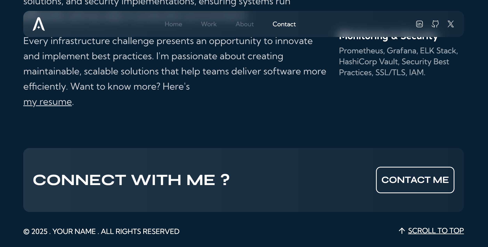

# Portfolio Website (Personal)

A production-ready portfolio application built with Next.js and React, designed with a DevOps-first mindset—focusing on automation, deployment pipelines, and maintainable infrastructure.

## Overview

This project goes beyond a typical frontend portfolio. It demonstrates how modern web applications can be built, deployed, and maintained using practical DevOps principles—even on a shared hosting environment (Hostinger).

The goal is simple: **treat even a personal project like a production system.**

## Tech Stack

* Next.js 14
* React 18
* Tailwind CSS
* Framer Motion
* EmailJS
* Docker

## Key Capabilities

### Application Layer

* Responsive and accessible UI
* Component-based architecture using Next.js App Router
* Optimized performance and SEO
* Contact form integrated with EmailJS

### DevOps & Infrastructure Thinking

* Version-controlled codebase with GitHub
* Automated deployment pipeline (Git-based deployment)
* Secure environment variable management
* Containerization support using Docker
* Production build optimization

## Preview




## Local Development

### Prerequisites

* Node.js (v18 or higher)
* npm

### Setup

```bash
git clone https://github.com/iemafzalhassan/community_project.git
cd community_project
npm install
```

### Environment Configuration

All sensitive configuration (such as EmailJS credentials) is managed using environment variables.

Create a `.env` file:

```env
NEXT_PUBLIC_EMAILJS_SERVICE_ID=your_service_id
NEXT_PUBLIC_EMAILJS_TEMPLATE_ID=your_template_id
NEXT_PUBLIC_EMAILJS_PUBLIC_KEY=your_public_key
```

These variables are not hardcoded in the application and are securely injected at runtime.

### Run

```bash
npm run dev
```

## Build & Runtime

```bash
npm run build
npm start
```

## Containerization

```bash
docker build -t community-portfolio .
docker run -p 3000:3000 community-portfolio
```

This ensures consistent environments across development and deployment.

## Deployment & CI/CD

**Live Website:** [https://www.ayushisingh.com](https://www.ayushisingh.com)

This project is deployed on a Hostinger shared server using an automated Git-based deployment workflow.

### Pipeline Flow

1. Code is pushed to GitHub
2. Hostinger auto-deployment detects changes
3. Build process is triggered on the server
4. Latest version is deployed to production

### DevOps Concepts Applied

* **Continuous Integration (CI)**
  Code changes are continuously integrated into the main branch

* **Continuous Deployment (CD)**
  Every push automatically updates the live application

* **Environment Variable Management**
  All secrets (EmailJS keys, configuration values) are stored securely using environment variables instead of being hardcoded

* **Service Integration (EmailJS)**
  Email functionality is handled via EmailJS, integrated using environment-based configuration for security and flexibility

* **Immutable Deployment Mindset**
  Each deployment replaces the previous version cleanly

* **Infrastructure Adaptation**
  CI/CD practices implemented effectively within shared hosting constraints

## Project Structure

```
community_portfolio/
├── app/
│   ├── components/
│   ├── contexts/
│   └── utils/
├── public/
└── contexts/
```

## Why This Project Matters

Most portfolio projects stop at “it works locally.”
This project demonstrates:

* How applications are deployed and maintained
* How secrets are managed securely
* How third-party services are integrated safely
* How CI/CD can be implemented even without full cloud infrastructure

It reflects practical, real-world DevOps thinking applied to a frontend system.

## Contributing

1. Fork the repository
2. Create a feature branch
3. Commit changes
4. Push and open a pull request

## License

MIT License

## Feedback

Open an issue for suggestions or improvements.
